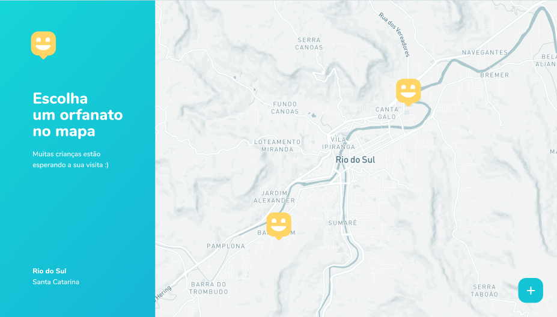
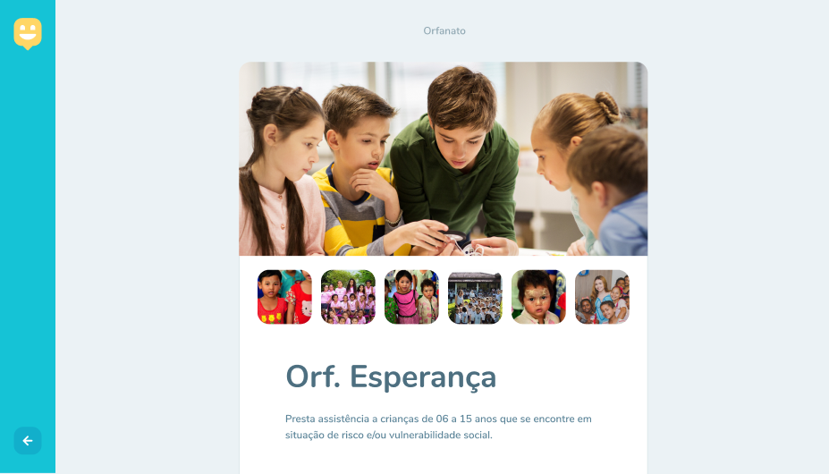
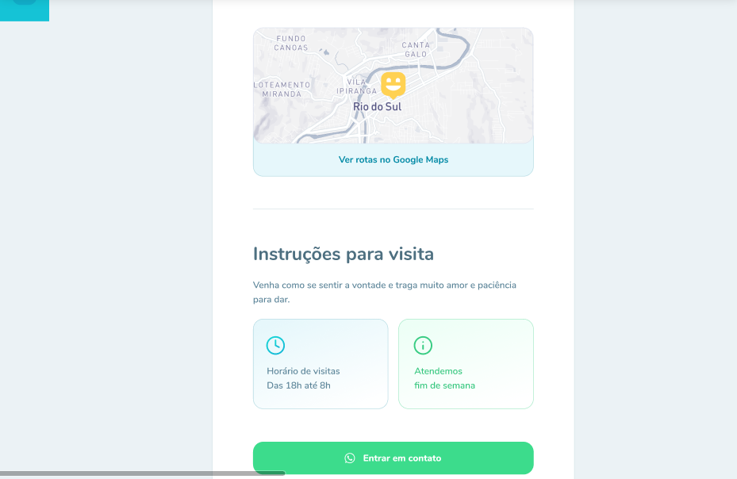
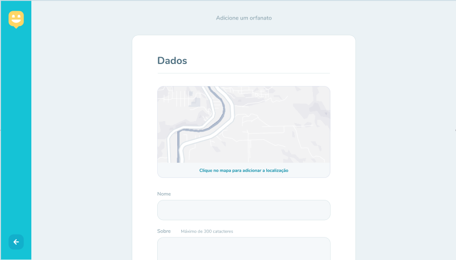
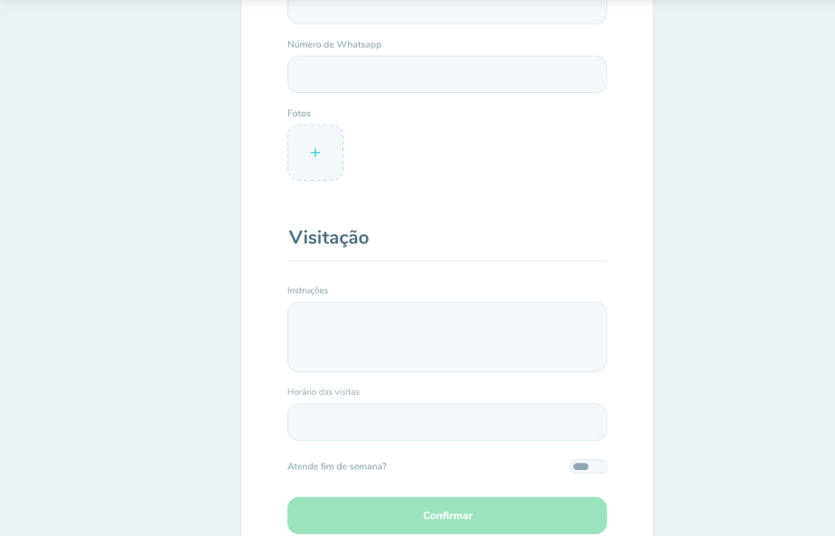
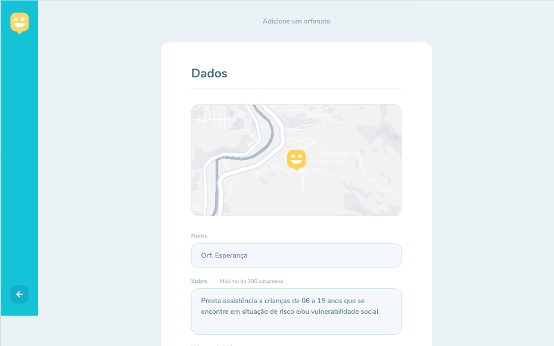
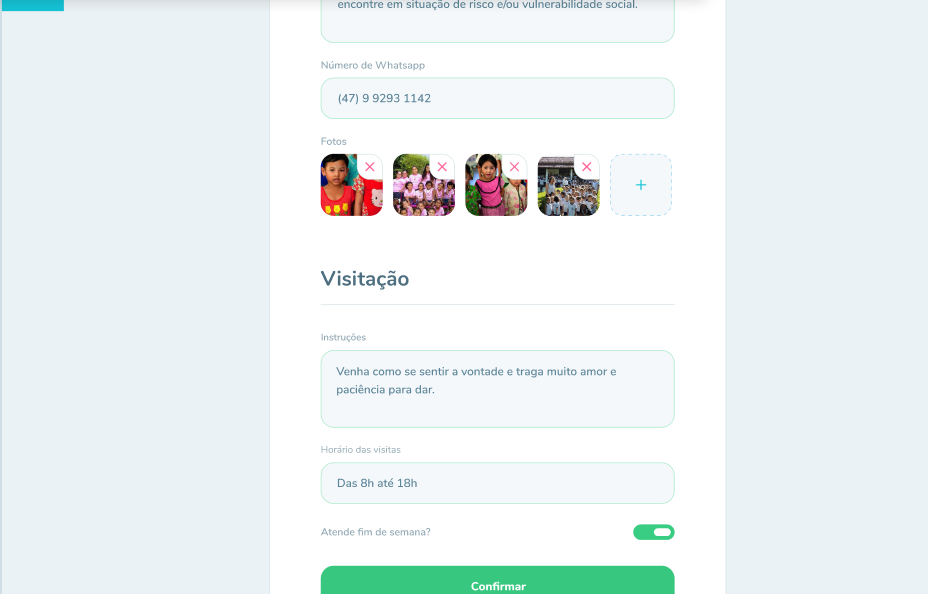

## :bulb: Next Level Week #3 - Happy Project

The "Happy" is a RockeatSeat initiative during the Next Level Week #3.
Happy is a project developed based on Children's Day. 
That aims to connect people to orphanages that allow to make a children's day more special.

## 🚀 Technologies

In this project were used these technologies:

<code></code>
<code></code> 
<code></code> 


## 🎨 WEB Layout 

<p align="center">
    <br/>  <br/>
   <br/>  <br/>
  
   <br/><br/>
   
   <br/>  <br/>
  
    <br/>  <br/>
</p>

<br>


## :information_source: How To run?

To clone and run this application, you'll need [Git](https://git-scm.com), Node.js and Yarn installed on your computer.


### Install API 

```bash
# Clone this repository
$ git clone https://github.com/SarahToscano/NLW-3

# Go into the repository
$ cd NLW-3/server

# Install dependencies
$ yarn install

# Run Migrates
$ yarn typeorm migration:run

# Start server
$ yarn dev:server

# running on port 3333
```

### Install Front-end

```bash
# Clone this repository
$ git clone https://github.com/SarahToscano/NLW-3

# Go into the repository
$ cd NLW-3.0/web

# Install dependencies
$ yarn install

# Run
$ yarn start

# running on port 3000
```

