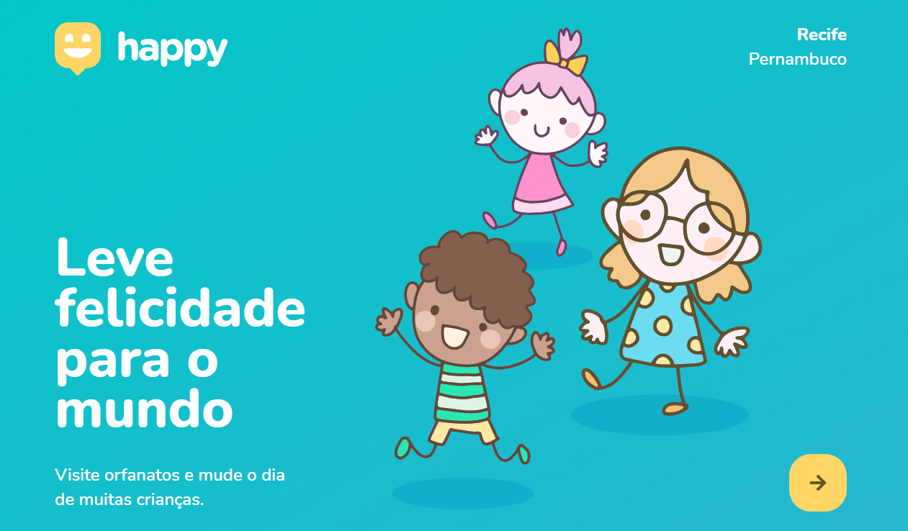

<h1 align="center">
    
</h1>

<p align="center">
  <a href="#-tecnologias">Tecnologias</a>&nbsp;&nbsp;&nbsp;|&nbsp;&nbsp;&nbsp;
  <a href="#-projeto">Projeto</a>&nbsp;&nbsp;&nbsp;|&nbsp;&nbsp;&nbsp;
  <a href="#-layout">Layout</a>&nbsp;&nbsp;&nbsp;|&nbsp;&nbsp;&nbsp;
  <a href="#memo-licença">Licença</a>
</p>

<p align="center">
 

  

  
</p>

<br>

<p align="center">
  
</p>

## 🚀 Tecnologias

Esse projeto foi desenvolvido com as seguintes tecnologias:

- [Node.js](https://nodejs.org/en/)
- [React](https://reactjs.org)
- [React Native](https://facebook.github.io/react-native/)
- [Expo](https://expo.io/)
- [TypeScript](https://www.typescriptlang.org/)

## 💻 Projeto

O Happy é uma iniciativa da Rocketseat durante a Nexte Level Week 3.0 para desenvolver uma aplicação que conecta pessoas à casas de acolhimento institucional para fazer o dia de muitas crianças mais feliz 💜

## 🔖 Layout

Nos links abaixo você encontra o layout do projeto web e também do mobile. Lembrando que você precisa ter uma conta no [Figma](http://figma.com/) para acessá-lo.

- [Layout Web](https://www.figma.com/file/mDEbnoojksG4w8sOxmudh3/Happy-Web)
- [Layout Mobile](https://www.figma.com/file/X27FfVxAgy9f5IFa7ONlph/Happy-Mobile)


<h1 align="center">
    
</h1>

<h4 align="center"> 
	:construction: NextLevelWeek 3.0 🚀 In progress...:construction:
</h4>
<p align="center">	
  
	

## :information_source: What's Next Level Week?

NLW is a practical week with lots of code, challenges, networking and a single objective: to take you to the next level.
Through our method you will learn new tools, learn about new technologies and discover hacks that will boost your career.
An online and completely free event that will help you take the next step in your evolution as a dev.


## 💻 Project

Happy is a project developed based on Children's Day. 
That aims to connect people to orphanages that allow to make a children's day more special.

<h1 align="center">
    
</h1>


## :rocket: Technologies

This project was developed with the following technologies:

- [Node.js][nodejs]
- [TypeScript][typescript]
- [React][reactjs]
- [React Native][rn]
<!-- - [Expo][expo] -->

## 🔖 Layout

To access the layout use [Figma](https://www.figma.com/file/mDEbnoojksG4w8sOxmudh3/Happy-Web/duplicate).


## :information_source: How To Use

To clone and run this application, you'll need [Git](https://git-scm.com), [Node.js][nodejs] + [Yarn][yarn] installed on your computer.

From your command line:

### Install API 

```bash
# Clone this repository
$ git clone https://github.com/SarahToscano/NLW-3

# Go into the repository
$ cd NLW-3/server

# Install dependencies
$ yarn install

# Run Migrates
$ yarn typeorm migration:run

# Start server
$ yarn dev:server

# running on port 3333
```

### Install Front-end

```bash
# Clone this repository
$ git clone https://github.com/SarahToscano/NLW-3

# Go into the repository
$ cd NLW-3.0/web

# Install dependencies
$ yarn install

# Run
$ yarn start

# running on port 3000
```

